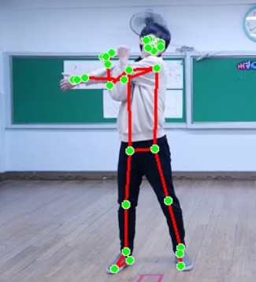

# Posture Analysis System

YouTube 영상에서 사람의 자세를 분석하여 스켈리톤과 자세 점수를 제공하는 시스템입니다.

## 프로젝트 개요

이 프로젝트는 YouTube 영상 URL을 입력받아 영상에서 사람의 자세를 분석하고, MediaPipe를 활용하여 스켈리톤을 추출한 후 자세 점수를 계산하여 시각화하는 웹 애플리케이션입니다.

주요 기능:
- YouTube 영상 다운로드 및 프레임 추출
- MediaPipe Pose를 사용한 실시간 자세 인식 및 스켈리톤 추출
- 어깨 정렬도, 척추 정렬도, 무릎 각도, 목 각도를 종합한 자세 점수 계산 (0-100점)
- 시간에 따른 점수 변화 그래프 시각화
- 스켈리톤이 그려진 프레임 이미지 표시 및 자동 재생

## 프로젝트 구조

```
PostureAnalysis/
├── frontend/                    # React 프론트엔드
│   ├── src/
│   │   ├── components/
│   │   │   ├── VideoPlayer.tsx      # YouTube 영상 플레이어
│   │   │   └── PostureAnalysis.tsx  # 분석 결과 표시 (그래프, 재생 컨트롤)
│   │   ├── services/
│   │   │   └── api.ts               # API 클라이언트
│   │   ├── App.tsx
│   │   └── main.tsx
│   ├── package.json
│   └── vite.config.ts
│
├── backend/                      # FastAPI 백엔드
│   ├── api/
│   │   ├── main.py                 # FastAPI 앱 진입점
│   │   └── routes/
│   │       ├── analysis.py         # 분석 API 라우트
│   │       └── health.py           # 헬스 체크
│   ├── services/
│   │   ├── youtube_processor.py   # YouTube 영상 처리
│   │   ├── pose_detector.py        # MediaPipe 자세 인식
│   │   ├── posture_analyzer.py     # 자세 점수 계산
│   │   └── analysis_processor.py  # 분석 파이프라인
│   ├── models/
│   │   ├── database.py             # PostgreSQL 모델
│   │   ├── memory_store.py         # 메모리 저장소
│   │   ├── db_store.py              # PostgreSQL 저장소
│   │   └── store_factory.py        # 저장소 팩토리
│   ├── tasks/
│   │   └── analysis_task.py        # Celery 작업 정의
│   ├── requirements.txt
│   └── Dockerfile
│
├── QUICK_START.md                 # 빠른 시작 가이드
├── DEPLOYMENT_GUIDE.md            # 배포 가이드
├── SECURITY.md                    # 보안 가이드
└── README.md                      # 이 파일
```

## 사용한 기술

### Frontend
- **React 18** + **Vite** - 빠른 개발 환경 및 모던 프론트엔드 프레임워크
- **TypeScript** - 타입 안정성 보장
- **Recharts** - 점수 그래프 시각화
- **Axios** - API 통신
- **YouTube IFrame API** - 영상 표시

### Backend
- **Python 3.11+** - 백엔드 언어
- **FastAPI** - 고성능 웹 프레임워크
- **MediaPipe Pose** - 자세 인식 AI 모델 (스켈리톤 추출 및 관절 위치 감지)
- **Celery** - 비동기 작업 큐 (프로덕션 환경)
- **PostgreSQL** - 데이터베이스 (프로덕션 환경)
- **Redis** - 작업 큐 브로커 (Celery와 함께 사용)
- **yt-dlp** - YouTube 영상 다운로드
- **OpenCV** - 영상 처리 및 프레임 추출

### MediaPipe 활용
이 프로젝트는 **MediaPipe Pose**를 핵심 기술로 사용합니다:
- MediaPipe Pose 모델을 통해 영상의 각 프레임에서 사람의 관절 위치(landmarks)를 감지
- 감지된 관절 위치를 기반으로 스켈리톤을 그려 프레임 이미지에 시각화
- 어깨, 척추, 무릎, 목 등의 관절 위치를 분석하여 자세 점수 계산



## 자세 점수 계산 방법

이 시스템은 MediaPipe Pose로 감지된 33개 관절 랜드마크를 기반으로 **4가지 항목**을 평가하여 총 **100점 만점**의 자세 점수를 계산합니다.

### 점수 구성 (각 항목 25점)

#### 1. 어깨 정렬도 (25점)
**평가 기준**: 좌우 어깨의 높이 차이

- 좌우 어깨의 Y 좌표 차이를 계산합니다
- 차이가 작을수록 높은 점수를 받습니다
- **계산 공식**: `점수 = max(0, 1 - 높이차이 × 10) × 25`

**예시**:
- 높이 차이 0.0 → **25점** (완벽)
- 높이 차이 0.05 → **12.5점** (양호)
- 높이 차이 0.1 이상 → **0점** (불량)

**의미**: 어깨가 수평에 가까울수록 좋은 자세입니다.

---

#### 2. 척추 정렬도 (25점)
**평가 기준**: 어깨 중심과 골반 중심의 X 좌표 차이 (측면 기울기)

- 어깨 중심점과 골반 중심점의 X 좌표 차이를 계산합니다
- 차이가 작을수록 높은 점수를 받습니다
- **계산 공식**: `점수 = max(0, 1 - 중심점차이 × 5) × 25`

**예시**:
- 중심점 차이 0.0 → **25점** (완벽)
- 중심점 차이 0.1 → **12.5점** (양호)
- 중심점 차이 0.2 이상 → **0점** (불량)

**의미**: 어깨와 골반이 수직으로 정렬될수록 좋은 자세입니다.

---

#### 3. 무릎 각도 (25점)
**평가 기준**: 무릎 관절의 각도 (골반-무릎-발목)

- 골반, 무릎, 발목 세 점 사이의 각도를 계산합니다
- 이상적인 각도 범위에 가까울수록 높은 점수를 받습니다
- **점수 기준**:
  - **160-180도**: **25점** (이상적 - 무릎이 거의 펴진 상태)
  - **140-160도**: **17.5점** (양호)
  - **140도 미만**: **7.5점** (불량)

**의미**: 무릎이 거의 펴진 상태(160-180도)일수록 좋은 자세입니다.

---

#### 4. 목 각도 (25점)
**평가 기준**: 코와 어깨 중심의 Y 좌표 차이 (고개 숙임 정도)

- 코의 Y 좌표가 어깨 중심보다 아래로 내려간 정도를 측정합니다
- 내려간 정도가 작을수록 높은 점수를 받습니다
- **계산 공식**: `점수 = max(0, min(1, 1 - 고개숙임 × 2)) × 25`

**예시**:
- 고개 숙임 0.0 → **25점** (완벽)
- 고개 숙임 0.25 → **12.5점** (양호)
- 고개 숙임 0.5 이상 → **0점** (불량)

**의미**: 고개를 너무 숙이지 않을수록 좋은 자세입니다.

---

### 최종 점수 계산

각 항목의 점수를 합산하여 총점을 계산합니다:

```
총점 = 어깨 정렬도 + 척추 정렬도 + 무릎 각도 + 목 각도
```

**점수 범위**: 0-100점

**예시 계산**:
```
어깨 정렬도: 20점
척추 정렬도: 22.5점
무릎 각도: 25점
목 각도: 17.5점
─────────────────
총점: 85점
```

### 평가의 특징

- **2D 기반 평가**: 주로 X, Y 좌표를 사용하여 평가합니다 (Z 좌표는 제한적으로 사용)
- **정적 평가**: 각 프레임을 독립적으로 평가하며, 동작의 흐름은 고려하지 않습니다
- **단순화된 기준**: 실제 자세 평가는 더 복잡할 수 있으나, 4가지 핵심 항목으로 간소화하여 평가합니다

### 개선 가능한 방향

향후 개선을 통해 다음 항목들을 추가로 평가할 수 있습니다:
- 양쪽 무릎 모두 평가 (현재는 왼쪽만)
- 척추 곡선 분석 (S자 곡선)
- 시간에 따른 변화 추적
- 좌우 균형 평가
- 전문가 기준 반영
